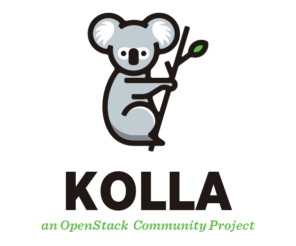

# Installing OpenStack Kolla-Ansible on CENTOS9 🚀

### Complete guide to install OpenStack with Kolla-Ansible on a CentOS machine

> All-in-one installation



## Prerequisites

- [ ] Server/Computer/Machine with CentOS9 installed
- [ ] 16 GB of RAM
- [ ] >70 GB of storage
- [ ] 2 network interfaces

#### Update and upgrade
---
```sh
sudo yum update && sudo yum upgrade
```

#### Install Python build dependencies
---
```sh
sudo dnf install git python3-devel libffi-devel gcc openssl-devel python3-libselinux
```

#### Install some pip packages
---
```
pip3 install -U pip
pip3 install wheel
pip3 install 'ansible<2.15'
```

#### Prepare the Kolla user
---
```sh
adduser kolla
```

```sh
usermod -aG sudo kolla
```

```sh
echo "kolla ALL=(ALL) NOPASSWD:ALL" | tee /etc/sudoers.d/kolla
```

```sh
su - kolla
```

#### Create the Openstack directory
---
```sh
mkdir /home/kolla/openstack
```

```sh
cd /home/kolla/openstack
```

#### Clone the `kolla-ansible` repository from git
---
```sh
git clone --branch master https://opendev.org/openstack/kolla-ansible
```

#### Install `kolla` and `kolla-ansible` dependencies
---
```sh
pip install ./kolla-ansible
```

#### Create the `/etc/kolla` directory
---
```sh
sudo mkdir -p /etc/kolla
```

```sh
sudo chown $USER:$USER /etc/kolla
```

#### Copy the configuration files
---
```sh
cp -r kolla-ansible/etc/kolla/* /etc/kolla
```

#### Copy the inventory files to the current directory
---
```sh
cp kolla-ansible/ansible/inventory/all-in-one .
```

#### Verify the configuration is correct
---
```sh
ansible -i all-in-one all -m ping
```

#### Install Ansible Galaxy dependencies:
```sh
kolla-ansible install-deps
```

#### Generate passwords
---
```sh
cd kolla-ansible/tools
```

```sh
./generate_passwords.py
```

#### Change the OpenStack Horizon admin password
---
```
sed -i 's#keystone_admin_password:.*#keystone_admin_password: kolla#g' /etc/kolla/passwords.yml
```

## Modify configuration files

#### Release the OpenStack network interface
---
> The first step before modifying the configuration file and running the installation playbooks is to prepare our OpenStack network interface. This interface will be used by the OpenStack Neutron service as a bridge to provide internet access to the OpenStack instances.

```sh
ifconfig [Network Interface] 0.0.0.0
```

> It can be set permanently

#### Globals.yml
---
```sh
nano /etc/kolla/globals.yml
```

```sh
kolla_base_distro: "centos" <- This is your distribution, here I implemented it on an CENTOS9 machine
kolla_install_type: "source"
kolla_internal_vip_address: "X.X.X.X" <-- CentOS server IP address
network_interface: "eth0" <-- network interface associated with CentOS IP
neutron_external_interface: "br_ex_port" <-- The 2nd network interface (bridge)
enable_openstack_core: "yes"
enable_haproxy: "no"
enable_neutron_provider_networks: "yes"
nova_compute_virt_type: "qemu"
```

## Deployment

#### Prepare the servers with Kolla deployment dependencies
---
```sh
cd kolla-ansible/tools
./kolla-ansible -i ../../all-in-one bootstrap-servers
```

#### Perform pre-deployment checks on the hosts
---
```sh
kolla-ansible -i ../../all-in-one prechecks
```

#### Finally proceed with the actual OpenStack deployment
---
```sh
kolla-ansible -i ../../all-in-one deploy
```

#### Install the OpenStack CLI client:
---
```sh
pip install python-openstackclient -c https://releases.openstack.org/constraints/upper/master
```

OR (The first option worked better)

```sh
yum install python-openstackclient
```

#### Verification
---
```sh
source /etc/kolla/admin-openrc.sh
openstack server list
```

#### Access the dashboard
---
```
Access the "kolla_internal_vip_address" defined earlier

Username: admin
Password: kolla
```

## Internet access for the instances

#### Initialize some variables
---
```
export EXT_NET_CIDR='YOUR LOCAL CIDR'
export EXT_NET_RANGE='start=X.X.X.240,end=X.X.X.250' <-- Floating IP range
export EXT_NET_GATEWAY='X.X.X.254' <-- Could be different
```

#### IP routing for instance internet access
---
```
sudo ifconfig [BRIDGE INTERFACE] $EXT_NET_GATEWAY netmask 255.255.255.0 up
sudo iptables -t nat -A POSTROUTING -s $EXT_NET_CIDR -o [eth0] -j MASQUERADE
```

